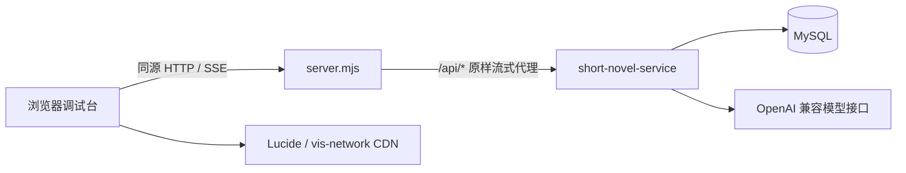

# Short Novel Debug Console

短篇小说服务的独立本地调试台，用于体验和调试完整会话工作流。

## 功能

- 多轮需求澄清与选项卡交互
- 大纲生成、确认和修改
- 小说正文 SSE 流式输出
- 模型供应商配置、连接测试和 Temperature 调整
- 每次请求的内容风控开关：默认/开启/关闭
- 中英文提示词与本次用户画像输入
- 六类系统提示词查看、临时调试和持久化
- 用户画像与知识图谱查看
- 图谱节点和关系的新增、查询、修改、删除与整图清空
- 从下拉框选择已有节点或关系直接编辑，类型候选可选也可自定义
- 每次新业务请求独立生成，同日多版本调试
- 原始 SSE 事件查看

## 本地启动

要求 Node.js 18 或更高版本，不需要安装第三方依赖。

```bash
npm run dev
```

打开：<http://127.0.0.1:5173>

默认代理到：`http://49.232.138.53:8010`

切换到其他后端：

```bash
API_TARGET=http://127.0.0.1:8010 npm run dev
```

修改本地端口：

```bash
PORT=5174 npm run dev
```

## 工作方式

浏览器只访问本地 `server.mjs`。本地服务器把 `/api/*` 原样转发到 `API_TARGET`，因此普通 JSON 请求和 SSE 流都不需要额外配置 CORS。

API Token 仅保存在当前浏览器标签页的内存中，不会写入源码或提交到 GitHub。读取或维护用户图谱、保存系统默认提示词时，在页面右侧填写服务端 API Token。

## 架构



- `index.html`：调试工作台、SSE 解析、澄清卡、大纲确认、图谱可视化和图谱编辑器。
- `server.mjs`：零依赖静态服务器和流式反向代理，不缓存首页，不缓冲 SSE。
- `API_TARGET`：唯一后端切换点，浏览器端始终只访问相对 `/api` 路径。

## 文档

- [前端架构和数据流](docs/frontend-architecture.md)
- [完整服务架构与接口文档](docs/service-architecture-and-api.md)
- [后端仓库](https://github.com/qascw159/short-novel-service)

## 校验

```bash
npm run check
```

## Request Examples

See [request examples and provider connection test](docs/request-examples.md) for Chinese/English conversation requests, provider configuration, and the non-persistent connection test endpoint.


## 最新接口说明

Base URL：`http://49.232.138.53:8010`。业务接口使用服务级凭证，
请求头为 `X-API-Token: <SERVICE_API_TOKEN>`（或 `Authorization: Bearer ...`）。
模型供应商 API Key 与服务 API Token 不同，不要将真实密钥写入代码或 README。

### 会话请求

`POST /api/novels/daily/conversation/stream`
请求头：`Content-Type: application/json`、`Accept: text/event-stream`。

| 入参 | 类型 | 说明 |
| --- | --- | --- |
| user_id | string | 必填，业务侧稳定用户ID |
| message_id | string | 建议必填，用户级幂等键，最长128字符 |
| query | string | 新会话必填 |
| session_id | string | 后续动作必填，使用SSE返回的会话ID |
| action | string | answer_clarification / modify_outline / confirm_outline / retry_generation / retry |
| payload | object | 澄清答案为 answer，修改意见为 feedback |
| language | string | zh-CN / en-US，也接受 zh / en；每次请求独立生效，省略默认中文 |
| safety_enabled | boolean | true 强制开启敏感词和安全模型；false 跳过；省略或null使用服务端两个默认开关 |
| user_profile | object | 可选，最大16000字符；保存于会话，省略/null保留，传新对象替换，{}清空外部画像 |
| model | string | 新会话可选，默认使用对应语言的配置，后续动作沿用会话模型 |
| temperature | number | 新会话可选，范围0-2；默认使用对应语言配置 |
| prompt_overrides | object | 按六种 PromptKey 覆盖系统提示词，保留结构和输出语言约束 |
| force_regenerate | boolean | 已废弃；生成频率由业务方控制 |

`safety_enabled` 按每次请求生效，不自动继承上一步的值。开始、回答澄清、修改大纲、
确认和重试都建议明确传递。它不修改服务器全局配置，true 可以覆盖当前服务端默认关闭状态。
缺省时分别采用 `SENSITIVE_WORDS_ENABLED` 和 `MODERATION_ENABLED`；
代码默认开启，但当前部署环境配置为关闭。安全模型不可用时，显式开启的请求仍按fail-closed报错。

控制范围为现有风控链路：用户query、澄清答复、修改意见的检查，澄清卡文本和正文的敏感词替换、
澄清输出及正文分块安全模型审核。先敏感词，再安全模型。
该参数不保证第三方生成模型不会自行拒绝内容，也不会关闭鉴权、参数校验或图谱数据校验。
幂等回放不重新生成或重新调用安全模型；已保存的屏蔽文本不会因关闭开关而恢复。

新会话示例：
```json
{
  "user_id": "user_001",
  "message_id": "msg_start_001",
  "query": "把今天的项目挫折写成温暖的成长故事",
  "language": "zh-CN",
  "safety_enabled": true,
  "model": "deepseek-v4-flash",
  "temperature": 0.7,
  "user_profile": {
    "occupation": "产品设计师",
    "interests": ["摄影", "旅行"],
    "content_preferences": {"tone": "温暖", "ending": "积极"}
  }
}
```

回答澄清：
```json
{"user_id":"user_001","session_id":"sess_xxx","message_id":"msg_answer_001","language":"zh-CN","safety_enabled":true,"action":"answer_clarification","payload":{"answer":"同事质疑了我的方案，后来我用数据证明了效果"}}
```

修改大纲：
```json
{"user_id":"user_001","session_id":"sess_xxx","message_id":"msg_modify_001","language":"zh-CN","safety_enabled":true,"action":"modify_outline","payload":{"feedback":"结尾更温暖"}}
```

确认大纲后生成正文：
```json
{"user_id":"user_001","session_id":"sess_xxx","message_id":"msg_confirm_001","language":"zh-CN","safety_enabled":true,"action":"confirm_outline"}
```

失败会话重试时使用新的 message_id 和 action=retry_generation。
网络重试同一请求使用原 message_id；历史已完成小说不会因language改变而自动翻译。

### 输出与画像

SSE每条 `data:` 均为JSON，包含 `type`、`session_id`、`payload`、`timestamp`。
事件类型：status、clarification_card、outline_created、novel_start、novel_delta、novel_done、error。
必须确认大纲才生成正文；字数目标中文约1500字符、英文约900词。
novel_delta.payload.delta 为增量文本，novel_done.payload.content 为完整正文。

生成和修改大纲都会参考user_profile；优先级是当前需求/修改意见 > 传入画像 > 历史画像。
传入画像不会直接写入长期画像或图谱。首次大纲生成后后台仍从真实输入补充画像和图谱。

中文模式的创作及画像系统/用户提示词使用中文，英文模式使用英文。
图谱抽取保持共享英文模板与英文关系编码。自定义prompt_overrides和已有会话快照不会自动翻译。
Flyway V8会备份并替换旧中文默认提示词，保留模型、温度及共享图谱模板。

常见错误码：SENSITIVE_WORD_BLOCKED、CONTENT_BLOCKED、CONTENT_MODERATION_UNAVAILABLE、
INVALID_USER_PROFILE、UNSUPPORTED_LANGUAGE。以payload.code及retryable处理，不要仅依赖提示文案。

### 配置与查询接口

| 方法 | 路径 | 用途 |
| --- | --- | --- |
| GET | /api/novels/daily/conversation/sessions/{id}?user_id=... | 查询会话、传入画像、后台memory状态 |
| GET | /api/novels/daily/conversation/debug-config?language=zh-CN | 查询分语言默认配置（公开、无密钥） |
| PUT | /api/novels/daily/conversation/debug-config | 保存language、default_model、default_temperature、prompts |
| GET/PUT | /api/novels/daily/conversation/provider-settings | 读取/保存全局供应商配置，Key只写不回显 |
| POST | /api/novels/daily/conversation/provider-settings/test | 测试未保存的供应商设置，不修改配置 |
| GET | /api/novels/knowledge-graph/{user_id} | 查询图谱 |
| POST/GET/PUT/DELETE | /api/novels/knowledge-graph/{user_id}/nodes[/{record_id}] | 节点CRUD |
| POST/GET/PUT/DELETE | /api/novels/knowledge-graph/{user_id}/edges[/{edge_id}] | 关系CRUD |

供应商连接测试请求：
```json
{"base_url":"https://api.example.com/v1","api_key":"<PROVIDER_API_KEY>","model":"model-id","thinking_mode":"disabled"}
```
thinking_mode支持disabled、enabled、omit。测试发起一次很短的真实模型请求，返回ok、code、
message、elapsed_ms、upstream_status，可能消耗少量额度；测试不等于保存。
更换供应商主机或端口必须同时填写新Key。

更多请求与风控错误说明见 [请求示例](docs/request-examples.md)。
