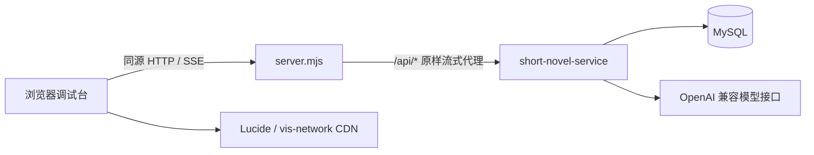

# Short Novel Debug Console

短篇小说服务的独立本地调试台，用于体验和调试完整会话工作流。

## 功能

- 多轮需求澄清与选项卡交互
- 大纲生成、确认和修改
- 小说正文 SSE 流式输出
- 模型和 Temperature 调整
- 六类系统提示词查看、临时调试和持久化
- 用户画像与知识图谱查看
- 图谱节点和关系的新增、查询、修改、删除与整图清空
- 从下拉框选择已有节点或关系直接编辑，类型候选可选也可自定义
- 每次新业务请求独立生成，同日多版本调试
- 原始 SSE 事件查看

## 本地启动

要求 Node.js 18 或更高版本，不需要安装第三方依赖。

```bash
npm run dev
```

打开：<http://127.0.0.1:5173>

默认代理到：`http://49.232.138.53:8010`

切换到其他后端：

```bash
API_TARGET=http://127.0.0.1:8010 npm run dev
```

修改本地端口：

```bash
PORT=5174 npm run dev
```

## 工作方式

浏览器只访问本地 `server.mjs`。本地服务器把 `/api/*` 原样转发到 `API_TARGET`，因此普通 JSON 请求和 SSE 流都不需要额外配置 CORS。

API Token 仅保存在当前浏览器标签页的内存中，不会写入源码或提交到 GitHub。读取或维护用户图谱、保存系统默认提示词时，在页面右侧填写服务端 API Token。

## 架构



- `index.html`：调试工作台、SSE 解析、澄清卡、大纲确认、图谱可视化和图谱编辑器。
- `server.mjs`：零依赖静态服务器和流式反向代理，不缓存首页，不缓冲 SSE。
- `API_TARGET`：唯一后端切换点，浏览器端始终只访问相对 `/api` 路径。

## 文档

- [前端架构和数据流](docs/frontend-architecture.md)
- [完整服务架构与接口文档](docs/service-architecture-and-api.md)
- [后端仓库](https://github.com/qascw159/short-novel-service)

## 校验

```bash
npm run check
```
