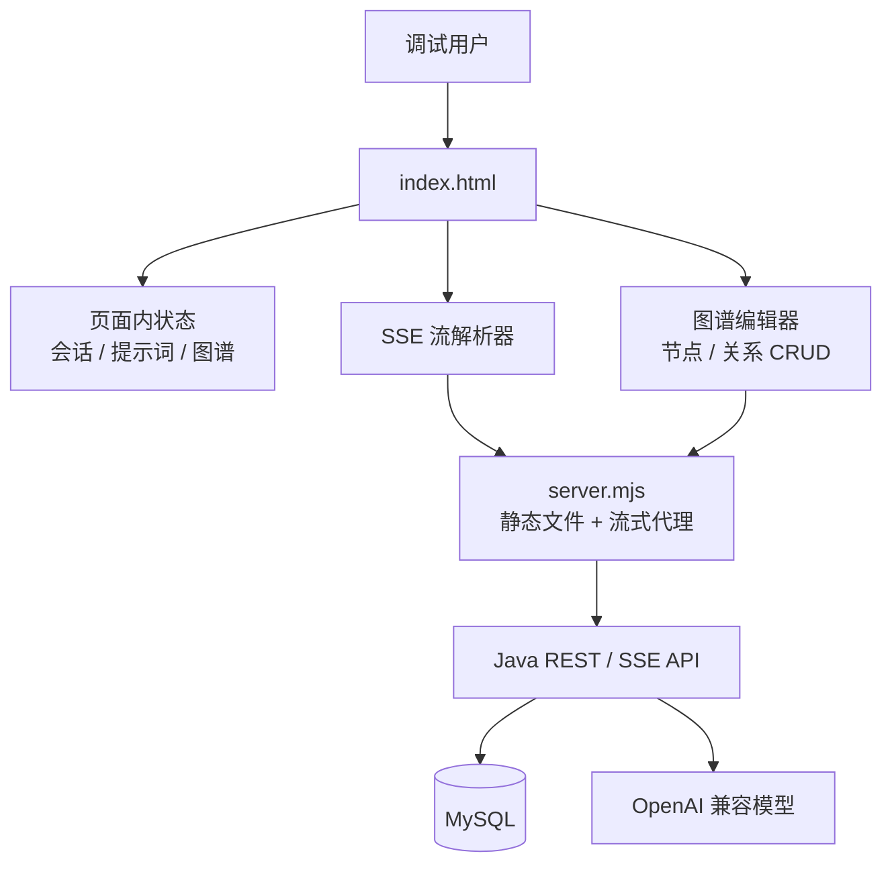
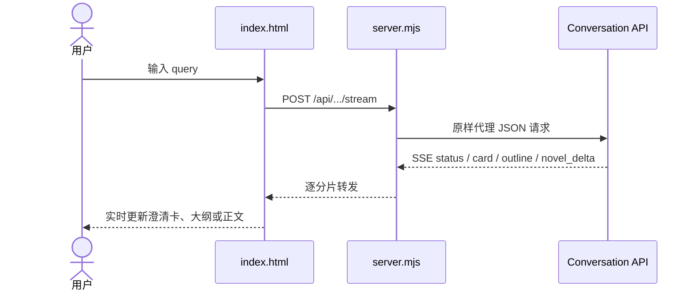
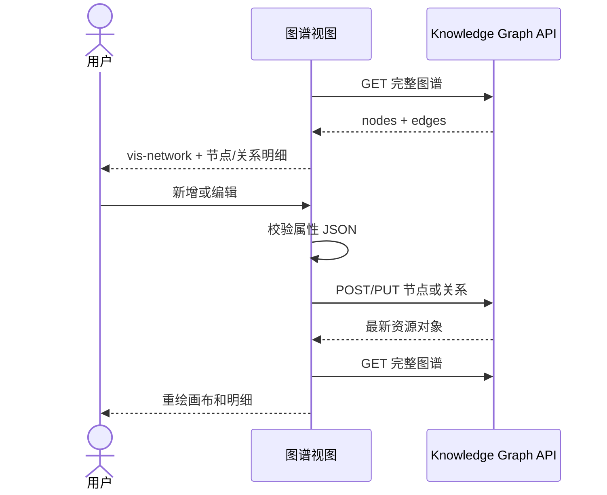

# 调试台前端架构

[TOC]

## 1. 定位

本仓库是 `short-novel-service` 的独立本地调试客户端。它不保存业务数据，也不直接持有模型密钥；所有业务状态由后端会话和 MySQL 持久化。

## 2. 运行架构

## 3. 文件职责

| 文件 | 职责 |
| --- | --- |
| `index.html` | 完整交互界面、样式、API 调用、SSE 解析、图谱可视化和编辑逻辑 |
| `server.mjs` | 提供首页，将 `/api/*` 转发到 `API_TARGET`，保持 SSE 分片实时传输 |
| `package.json` | 定义零依赖启动和 JavaScript 语法检查命令 |
| `docs/service-architecture-and-api.md` | 后端完整架构、状态机和全部接口文档 |

当前页面采用单文件结构，是为了与后端内置的 `src/main/resources/static/debug.html` 保持逐字同步，避免两套调试界面行为漂移。页面逻辑继续增长时，可按 `api-client.js`、`conversation-view.js`、`graph-editor.js`、`styles.css` 拆分，但应同时调整后端静态资源构建方式。

## 4. 会话数据流

页面使用 `fetch` 和 `ReadableStream` 解析 POST SSE，不使用只支持 GET 的 `EventSource`。`message_id` 每次业务操作重新生成，同一网络重试应复用原值。

## 5. 图谱维护数据流

节点编辑路径使用响应中的数字 `record_id`；关系请求中的 `source`、`target` 使用节点图内部 `id`。删除节点前会提示其关联关系也会删除，清空整图必须二次确认。

## 6. 本地代理

`server.mjs` 只暴露 `/`、`/index.html` 和 `/api/*`：

- 首页返回 `Cache-Control: no-store`，确保调试修改立即生效。
- API 请求保留方法、请求体和鉴权头。
- 上游响应使用 Node.js Stream 直接 pipe，不聚合 SSE 正文。
- 上游不可用时返回 `502` JSON，不泄露 Token。

## 7. 安全边界

- API Token 只存在于当前标签页内存，不进入 `localStorage`、源码或 Git。
- 模型 API Key 只配置在 Java 服务端。
- 用户 ID 会进入 `localStorage`，用于下次打开时恢复调试对象。
- 本地服务默认只监听 `127.0.0.1`；需要局域网访问时显式设置 `HOST`。
- 图谱写操作和提示词固化都由后端 Token 鉴权，前端不作为权限边界。

## 8. 验证清单

1. `npm run check` 检查本地代理语法。
2. 对 `index.html` 的内联脚本运行 `node --check`。
3. 验证配置接口可经本地代理读取。
4. 验证图谱节点创建、读取、修改、删除。
5. 验证关系创建、读取、修改、删除和重复冲突。
6. 验证节点改名后关系展示同步。
7. 验证清空整图后节点和关系均为零。
8. 浏览器检查桌面和移动布局、控制台错误及 SSE 流式输出。
