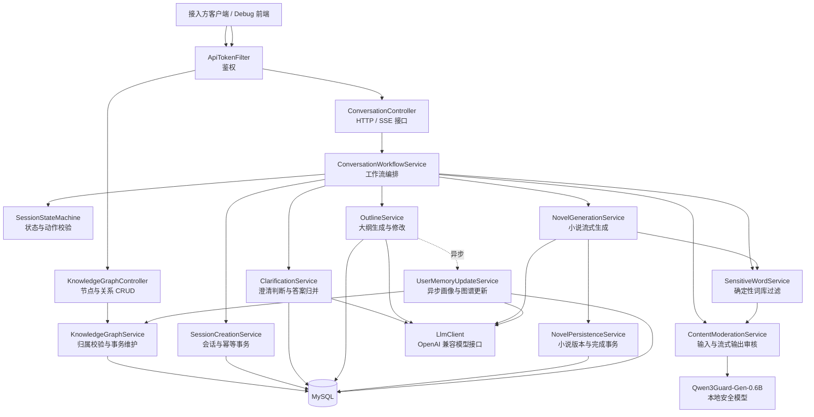
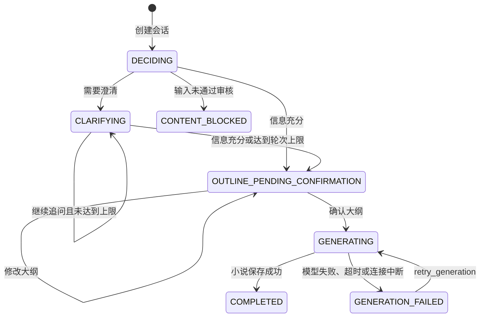
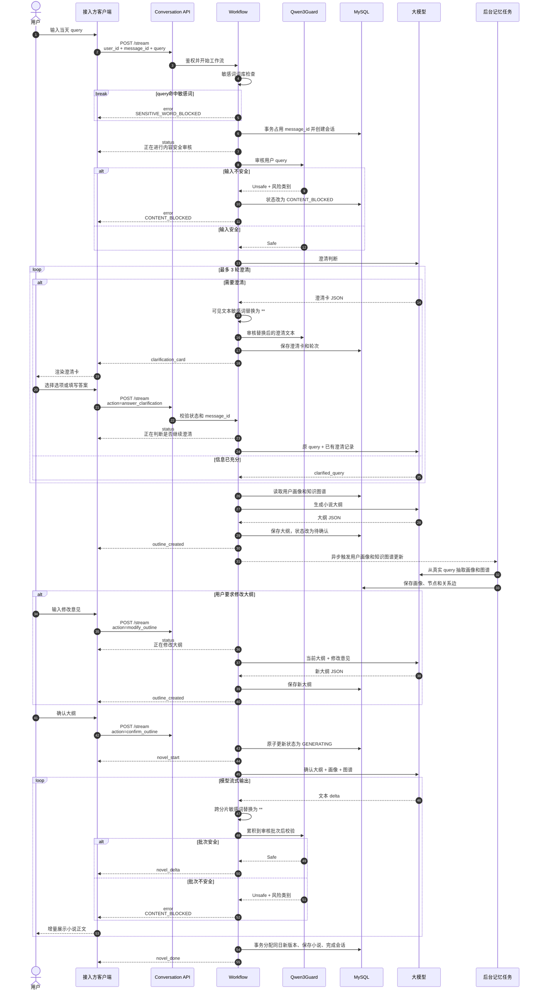
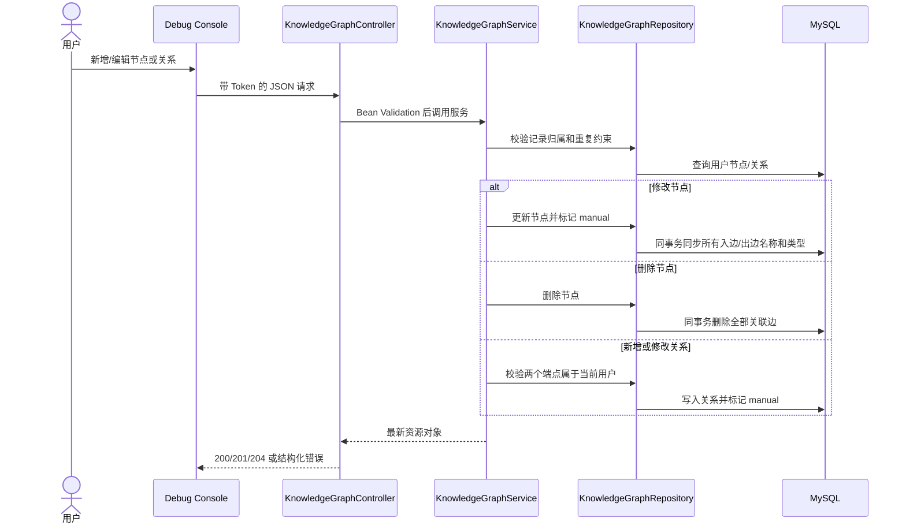

# 短篇小说服务架构与接口文档

> 文档版本：1.2
> 服务地址：`http://49.232.138.53:8010`  
> 默认模型：`deepseek-v4-flash`  
> 核心协议：HTTP + Server-Sent Events（SSE）

[TOC]

## 1. 项目概述

短篇小说服务接收用户当天的一条真实输入，根据输入完整度决定是否需要澄清。需求明确后，服务结合用户画像和知识图谱生成小说大纲，等待用户确认或修改；用户确认后，服务流式生成约 1500 字的中文短篇爽文。

系统同时具备以下能力：

- 澄清卡支持单选、多选、文本输入和混合输入。
- 澄清可多轮进行，默认最多 3 轮。
- 大纲必须由用户确认后才生成小说。
- 小说正文通过 SSE 增量返回。
- 用户画像和知识图谱在大纲生成后异步更新。
- 用户可通过 REST API 或调试台手工维护图谱节点和关系，手工数据优先于 AI 自动补全。
- 服务不限制每日生成次数；调用方通过是否发起新业务请求控制生成频率。
- `message_id` 提供请求幂等，防止重复提交消耗澄清轮次或生成重复小说。
- 会话和小说状态持久化，可在断线后查询和恢复。

## 2. 项目架构

### 2.1 分层架构



### 2.2 核心模块职责

| 模块 | 职责 |
| --- | --- |
| `ConversationController` | 暴露 SSE 会话、会话状态和调试配置接口 |
| `ConversationWorkflowService` | 识别新会话或已有会话，编排澄清、大纲、小说和重试流程 |
| `SessionStateMachine` | 判断当前会话状态是否允许执行指定动作 |
| `ClarificationService` | 判断是否需要澄清、规范化澄清卡、记录澄清答案，限制最大轮次 |
| `OutlineService` | 读取画像与图谱，生成或修改大纲，并触发后台记忆更新 |
| `NovelGenerationService` | 返回 `novel_start`、`novel_delta`、`novel_done`，处理超时、断连和失败 |
| `SensitiveWordService` | 在模型审核前执行词库匹配；输入命中时拒绝，模型输出命中时跨分片替换为 `**` |
| `ContentModerationService` | 在模型调用前审核用户输入；按字符批次审核正文，审核通过后才向 SSE 下游释放 |
| `SessionCreationService` | 在同一事务中占用 `message_id` 并创建会话 |
| `NovelPersistenceService` | 在同一事务中分配小说版本、保存小说并完成会话 |
| `UserMemoryUpdateService` | 异步更新用户画像和知识图谱，只使用用户真实输入，不使用虚构小说正文 |
| `KnowledgeGraphController` | 暴露整图查询、节点 CRUD、关系 CRUD 和清空接口 |
| `KnowledgeGraphService` | 校验节点归属和重复关系，事务同步冗余名称，保护手工维护数据 |
| `OpenAiCompatibleLlmClient` | 按 OpenAI Chat Completions 格式调用模型，支持普通请求和流式请求 |
| Flyway | 管理数据库结构版本，当前迁移版本为 `v4` |
| `SessionCleanupService` | 定时清理过期会话和幂等记录 |

### 2.3 核心数据表

| 数据表 | 用途 |
| --- | --- |
| `novel_generation_sessions` | 保存会话状态、澄清记录、大纲、模型配置、小说版本和错误信息 |
| `novel_request_receipts` | 保存 `(user_id, message_id)` 幂等记录 |
| `novel_daily_counters` | 原子分配同一用户同一天的小说版本号 |
| `daily_novels` | 保存小说大纲、正文、版本和扩展信息 |
| `user_profiles` | 保存用户画像、当前状态和摘要 |
| `user_knowledge_graph` | 保存用户实体节点及实体关系边；`extraction_model=manual` 表示用户手工维护 |
| `novel_runtime_config` | 保存默认模型、温度和系统提示词 |
| `flyway_schema_history` | 保存 Flyway 数据库迁移历史 |

### 2.4 会话状态机



| 状态 | 含义 | 客户端可执行动作 |
| --- | --- | --- |
| `DECIDING` | 正在判断是否需要澄清 | `retry` |
| `CLARIFYING` | 等待用户回答澄清卡 | `answer_clarification`、`retry` |
| `OUTLINE_PENDING_CONFIRMATION` | 大纲已生成，等待确认 | `confirm_outline`、`modify_outline`、`retry` |
| `GENERATING` | 小说正在流式生成 | 查询会话状态，不要重复确认 |
| `GENERATION_FAILED` | 小说生成失败或流连接中断 | `retry_generation`、`retry` |
| `CONTENT_BLOCKED` | 初始输入未通过内容安全审核 | 修改输入并创建新会话 |
| `COMPLETED` | 小说已生成并保存 | 查询小说结果 |

## 3. 用户 Query 完整时序图



## 4. 接口接入约定

### 4.1 Base URL

```text
http://49.232.138.53:8010
```

生产接入建议通过 HTTPS 网关转发，不建议在公网直接传输明文 Token。

### 4.2 鉴权

除健康检查、调试页面和只读调试配置外，接口需要携带 API Token。支持以下任一方式：

```http
X-API-Token: <YOUR_API_TOKEN>
```

或：

```http
Authorization: Bearer <YOUR_API_TOKEN>
```

未携带或 Token 不正确时返回：

```http
HTTP/1.1 401 Unauthorized

Unauthorized
```

### 4.3 SSE 响应格式

核心会话接口返回 `Content-Type: text/event-stream`。每个事件由一行 `data:` 承载：

```text
data: {"type":"status","session_id":"sess_xxx","payload":{"stage":"deciding","message":"正在判断是否需要澄清"},"timestamp":"2026-07-11T15:00:00Z"}

data: {"type":"clarification_card","session_id":"sess_xxx","payload":{"card":{}},"timestamp":"2026-07-11T15:00:10Z"}
```

所有事件统一结构：

| 字段 | 类型 | 说明 |
| --- | --- | --- |
| `type` | string | 事件类型 |
| `session_id` | string/null | 会话 ID；参数校验发生在会话创建前时可能为 `null` |
| `payload` | object | 事件数据，不同事件结构不同 |
| `timestamp` | string | UTC ISO-8601 时间 |

### 4.4 全部接口总表

| 分组 | 方法 | 路径 | 鉴权 | 说明 |
| --- | --- | --- | --- | --- |
| 会话 | POST | `/api/novels/daily/conversation/stream` | 是 | 新建或继续会话，返回 SSE |
| 会话 | GET | `/api/novels/daily/conversation/sessions/{session_id}` | 是 | 查询会话、小说和后台记忆状态 |
| 调试配置 | GET | `/api/novels/daily/conversation/debug-config` | 否 | 查询默认模型、温度和提示词 |
| 调试配置 | PUT | `/api/novels/daily/conversation/debug-config` | 是 | 持久化默认模型、温度和提示词 |
| 图谱 | GET | `/api/novels/knowledge-graph/{user_id}` | 是 | 查询完整图谱 |
| 图谱节点 | POST | `/api/novels/knowledge-graph/{user_id}/nodes` | 是 | 新增节点 |
| 图谱节点 | GET | `/api/novels/knowledge-graph/{user_id}/nodes/{record_id}` | 是 | 查询节点 |
| 图谱节点 | PUT | `/api/novels/knowledge-graph/{user_id}/nodes/{record_id}` | 是 | 完整更新节点 |
| 图谱节点 | DELETE | `/api/novels/knowledge-graph/{user_id}/nodes/{record_id}` | 是 | 删除节点及其关联关系 |
| 图谱关系 | POST | `/api/novels/knowledge-graph/{user_id}/edges` | 是 | 新增关系 |
| 图谱关系 | GET | `/api/novels/knowledge-graph/{user_id}/edges/{edge_id}` | 是 | 查询关系 |
| 图谱关系 | PUT | `/api/novels/knowledge-graph/{user_id}/edges/{edge_id}` | 是 | 完整更新关系 |
| 图谱关系 | DELETE | `/api/novels/knowledge-graph/{user_id}/edges/{edge_id}` | 是 | 删除关系 |
| 图谱 | DELETE | `/api/novels/knowledge-graph/{user_id}` | 是 | 清空用户图谱 |
| 兼容用户 | GET/POST | `/users`、`/users/by-name` | 是 | 旧用户数据接口 |
| 兼容画像 | GET/POST | `/user-profiles/...` | 是 | 旧画像数据接口 |
| 兼容小说 | GET/POST | `/daily-novels/...` | 是 | 旧小说数据接口 |
| 运维 | GET | `/actuator/health`、`/actuator/info` | 否 | 健康和服务信息 |
| 已废弃 | POST | `/api/novels/daily/generate` | 是 | 固定返回 `410 Gone` |

## 5. 核心会话接口

### 5.1 开始会话或继续会话

```http
POST /api/novels/daily/conversation/stream
Content-Type: application/json
Accept: text/event-stream
X-API-Token: <YOUR_API_TOKEN>
```

新建会话和会话后续动作共用同一个接口，通过是否传递 `session_id` 区分。

#### 请求字段

| 字段 | 类型 | 新会话 | 后续动作 | 说明 |
| --- | --- | --- | --- | --- |
| `user_id` | string | 必填 | 必填 | 业务系统中的稳定用户 ID |
| `message_id` | string | 强烈建议 | 强烈建议 | 用户级幂等键，最长 128 字符 |
| `session_id` | string | 不传 | 必填 | 首次 SSE 事件返回的会话 ID |
| `query` | string | 必填 | 不传 | 用户当天的原始输入 |
| `action` | string | 不传 | 必填 | 会话动作，见动作表 |
| `payload` | object/string | 可选 | 按动作传递 | 动作参数 |
| `model` | string | 可选 | 忽略 | 模型 ID，默认 `deepseek-v4-flash` |
| `temperature` | number | 可选 | 忽略 | 范围会被限制到 `0.0-2.0`，默认 `0.7` |
| `prompt_overrides` | object | 可选 | 忽略 | 本会话提示词覆盖，创建后固化在会话中 |
| `force_regenerate` | boolean | 可选 | 忽略 | 已废弃，仅为兼容旧调用方保留，传入任何值都不影响流程 |

#### 动作表

| `action` | 使用状态 | `payload` | 说明 |
| --- | --- | --- | --- |
| `answer_clarification` | `CLARIFYING` | `{"answer": ...}` | 回答澄清卡 |
| `confirm_outline` | `OUTLINE_PENDING_CONFIRMATION` | 无 | 确认大纲并开始流式生成小说 |
| `modify_outline` | `OUTLINE_PENDING_CONFIRMATION` | `{"feedback":"..."}` | 修改大纲 |
| `retry_generation` | `GENERATION_FAILED` | 无 | 重试小说生成 |
| `retry` | 可恢复状态 | 无 | 重新执行或回放当前步骤 |

兼容动作别名包括 `answer`、`clarification_answer`、`confirm` 和 `modify`，新接入方应使用动作表中的标准名称。

### 5.2 新建会话示例

```json
{
  "user_id": "user_10001",
  "message_id": "msg_20260711_0001",
  "query": "今天很不开心",
  "model": "deepseek-v4-flash",
  "temperature": 0.7
}
```

服务会立即返回 `status`，之后返回以下结果之一：

- `clarification_card`：需要用户继续补充。
- `outline_created`：信息充分，已生成待确认大纲。
- `error`：工作流处理失败。

### 5.3 回答文本或单选澄清卡

```json
{
  "session_id": "sess_0123456789abcdefghij",
  "user_id": "user_10001",
  "message_id": "msg_20260711_0002",
  "action": "answer_clarification",
  "payload": {
    "answer": "表姐，她在家人面前否定了我的工作成果"
  }
}
```

### 5.4 回答多选或混合澄清卡

```json
{
  "session_id": "sess_0123456789abcdefghij",
  "user_id": "user_10001",
  "message_id": "msg_20260711_0003",
  "action": "answer_clarification",
  "payload": {
    "answer": {
      "selections": ["prove_with_data", "public_apology"],
      "custom_text": "希望结尾不要过度惩罚对方"
    }
  }
}
```

客户端应根据澄清卡中的 `min_selections` 和 `max_selections` 限制选择数量。

### 5.5 修改大纲

```json
{
  "session_id": "sess_0123456789abcdefghij",
  "user_id": "user_10001",
  "message_id": "msg_20260711_0004",
  "action": "modify_outline",
  "payload": {
    "feedback": "保留逆袭主线，但结尾更温暖，不要让反派受到过度惩罚"
  }
}
```

修改完成后再次返回 `outline_created`，客户端应使用新大纲覆盖旧大纲。

### 5.6 确认大纲并生成小说

```json
{
  "session_id": "sess_0123456789abcdefghij",
  "user_id": "user_10001",
  "message_id": "msg_20260711_0005",
  "action": "confirm_outline"
}
```

正常事件顺序：

```text
novel_start
novel_delta
novel_delta
...
novel_done
```

### 5.7 重试小说生成

```json
{
  "session_id": "sess_0123456789abcdefghij",
  "user_id": "user_10001",
  "message_id": "msg_20260711_retry_0001",
  "action": "retry_generation"
}
```

仅当会话状态为 `GENERATION_FAILED` 时可调用。

## 6. SSE 事件文档

### 6.1 `status`

表示服务已经接收请求，正在执行耗时步骤。

```json
{
  "type": "status",
  "session_id": "sess_xxx",
  "payload": {
    "stage": "deciding",
    "message": "正在判断是否需要澄清"
  },
  "timestamp": "2026-07-11T15:00:00Z"
}
```

常见 `stage`：

| `stage` | 含义 |
| --- | --- |
| `deciding` | 判断需求是否需要澄清 |
| `clarifying` | 判断是否继续澄清 |
| `outline_generating` | 生成小说大纲 |
| `outline_modifying` | 修改小说大纲 |
| `generating` | 幂等回放时表示小说仍在生成 |
| `completed` | 幂等回放时表示请求已完成 |

### 6.2 `clarification_card`

```json
{
  "type": "clarification_card",
  "session_id": "sess_xxx",
  "payload": {
    "card": {
      "card_type": "single_select",
      "question": "是谁让你不开心？",
      "description": "请选择最接近的关系，也可以直接填写",
      "options": [
        {
          "value": "family",
          "label": "家人",
          "description": "父母、亲戚或伴侣"
        },
        {
          "value": "coworker",
          "label": "同事",
          "description": "同事或上级"
        }
      ],
      "allow_custom": true,
      "min_selections": 1,
      "max_selections": 1,
      "input_placeholder": "也可以直接说是谁",
      "round": 1,
      "max_rounds": 3
    }
  },
  "timestamp": "2026-07-11T15:00:10Z"
}
```

`card_type` 取值：

| 类型 | 客户端控件 | 回答格式 |
| --- | --- | --- |
| `single_select` | 单选项，可附加自定义文本 | 字符串 |
| `multi_select` | 多选项 | `selections + custom_text` |
| `text_input` | 文本输入框 | 字符串 |
| `mixed` | 多选项 + 文本输入框 | `selections + custom_text` |

### 6.3 `outline_created`

```json
{
  "type": "outline_created",
  "session_id": "sess_xxx",
  "payload": {
    "outline": {
      "title": "数据为王",
      "logline": "主角用真实项目数据回应亲戚的否定。",
      "protagonist": {
        "identity": "项目负责人",
        "goal": "证明自己的工作成果",
        "strength": "专业与冷静"
      },
      "antagonistic_force": "亲戚的公开质疑",
      "emotional_target": "释放委屈并获得认可",
      "core_pleasure": "用事实完成反转",
      "beats": [
        {
          "order": 1,
          "title": "当众否定",
          "summary": "聚会中主角的成果被轻视。",
          "emotional_change": "委屈转为克制"
        }
      ],
      "ending": "对方承认判断错误，主角获得家人尊重。",
      "estimated_chinese_characters": 1500
    },
    "requires_confirmation": true,
    "allowed_actions": ["confirm_outline", "modify_outline"]
  },
  "timestamp": "2026-07-11T15:01:00Z"
}
```

大纲至少保证存在 `title` 和数组类型的 `beats`。其余字段由当前系统提示词约定。

### 6.4 `novel_start`

```json
{
  "type": "novel_start",
  "session_id": "sess_xxx",
  "payload": {
    "model": "deepseek-v4-flash",
    "temperature": 0.7,
    "target_chinese_characters": 1500
  },
  "timestamp": "2026-07-11T15:02:00Z"
}
```

客户端收到该事件后应清空本次正文缓冲区，并进入流式展示状态。

### 6.5 `novel_delta`

```json
{
  "type": "novel_delta",
  "session_id": "sess_xxx",
  "payload": {
    "delta": "会议室里忽然安静下来。"
  },
  "timestamp": "2026-07-11T15:02:01Z"
}
```

客户端应按接收顺序直接追加 `payload.delta`，不要对单个分片做 JSON、Markdown 或句子级解析。

### 6.6 `novel_done`

新小说生成完成：

```json
{
  "type": "novel_done",
  "session_id": "sess_xxx",
  "payload": {
    "generated": true,
    "novel_id": 1001,
    "novel_version": 1,
    "title": "数据为王",
    "content": "完整小说正文……",
    "character_count": 1450,
    "length_target_met": true
  },
  "timestamp": "2026-07-11T15:03:00Z"
}
```

同一个 `message_id` 在小说完成后重发时，服务回放已保存的最终结果：

```json
{
  "type": "novel_done",
  "session_id": "sess_xxx",
  "payload": {
    "generated": true,
    "replayed": true,
    "novel_id": 1001,
    "novel_version": 1,
    "title": "数据为王",
    "outline": "{...}",
    "content": "完整小说正文……"
  },
  "timestamp": "2026-07-11T15:03:00Z"
}
```

客户端应以 `novel_done.payload.content` 作为最终正文真值。正常流式生成时，它应与所有 `novel_delta` 拼接结果一致。

### 6.7 `error`

```json
{
  "type": "error",
  "session_id": "sess_xxx",
  "payload": {
    "code": "NOVEL_GENERATION_FAILED",
    "message": "小说生成失败，可使用同一 session_id 重试",
    "retryable": true
  },
  "timestamp": "2026-07-11T15:03:00Z"
}
```

客户端应以 `payload.retryable` 判断是否展示重试按钮，不应根据错误文案做程序判断。

## 7. 查询会话状态

```http
GET /api/novels/daily/conversation/sessions/{session_id}?user_id={user_id}
X-API-Token: <YOUR_API_TOKEN>
```

示例：

```http
GET /api/novels/daily/conversation/sessions/sess_0123456789abcdefghij?user_id=user_10001
```

响应：

```json
{
  "session_id": "sess_0123456789abcdefghij",
  "user_id": "user_10001",
  "novel_date": "2026-07-11",
  "status": "OUTLINE_PENDING_CONFIRMATION",
  "clarification_round": 2,
  "clarification_card": null,
  "outline": {
    "title": "数据为王",
    "beats": []
  },
  "model": "deepseek-v4-flash",
  "temperature": 0.7,
  "prompt_overrides": {},
  "novel_id": null,
  "novel_version": null,
  "memory_update_status": "RUNNING",
  "memory_error_message": null,
  "error_code": null,
  "error_message": null,
  "created_at": "2026-07-11T23:00:00",
  "updated_at": "2026-07-11T23:01:00"
}
```

`session_id` 不存在，或 `session_id` 与 `user_id` 不匹配时返回 `404 Not Found`。

### 7.1 后台记忆状态

| 状态 | 含义 |
| --- | --- |
| `PENDING` | 尚未开始更新 |
| `RUNNING` | 正在更新画像和图谱 |
| `COMPLETED` | 更新成功 |
| `FAILED` | 更新失败，可通过 `memory_error_message` 排查 |
| `SKIPPED` | 旧版本每日限额产生的历史会话未执行记忆更新；当前版本不再新增此状态 |

## 8. 用户知识图谱接口

图谱由节点和有向关系组成。整图中的节点 `id` 是图内部实体 ID，用于关系的 `source`、`target`；节点 CRUD 路径使用数字 `record_id`。关系 CRUD 路径使用关系的数字 `id`。

所有写操作满足以下规则：

- `properties` 必须是 JSON 对象，不能是数组、字符串或数字。
- `confidence` 范围为 `0.0-1.0`，不传时手工数据默认使用 `1.0`。
- 相同用户下，节点的 `(type, name)` 不能重复。
- 相同用户下，关系的 `(source, relation, target)` 不能重复。
- 创建和修改关系时，源节点、目标节点必须属于路径中的用户。
- 手工创建或修改后 `provenance=manual`，后续 AI 自动抽取不会覆盖该记录。
- 修改节点名称或类型时，所有关联边中的冗余名称和类型会在同一事务中同步。
- 删除节点会在同一事务中删除它的全部入边和出边。

### 8.1 查询完整图谱

```http
GET /api/novels/knowledge-graph/{user_id}
X-API-Token: <YOUR_API_TOKEN>
```

响应：

```json
{
  "user_id": "user_10001",
  "nodes": [
    {
      "record_id": 17,
      "id": "person:表姐",
      "name": "表姐",
      "type": "person",
      "properties": {
        "relationship": "亲戚"
      },
      "confidence": 0.9,
      "provenance": "ai",
      "source_date": "2026-07-17",
      "created_at": "2026-07-17T10:00:00",
      "updated_at": "2026-07-17T10:00:00"
    }
  ],
  "edges": [
    {
      "id": 31,
      "source": "person:用户",
      "target": "person:表姐",
      "relation": "relative_of",
      "source_type": "person",
      "source_name": "用户",
      "target_type": "person",
      "target_name": "表姐",
      "properties": {},
      "confidence": 0.9,
      "provenance": "ai",
      "source_date": "2026-07-17",
      "created_at": "2026-07-17T10:00:00",
      "updated_at": "2026-07-17T10:00:00"
    }
  ]
}
```

用户暂时没有图谱时仍返回 `200 OK`，`nodes` 和 `edges` 为空数组。

### 8.2 新增节点

```http
POST /api/novels/knowledge-graph/{user_id}/nodes
Content-Type: application/json
X-API-Token: <YOUR_API_TOKEN>
```

```json
{
  "name": "表姐",
  "type": "person",
  "properties": {
    "relationship": "亲戚",
    "note": "在同一家公司工作"
  },
  "confidence": 1.0
}
```

成功返回 `201 Created`，并包含新节点。服务生成稳定的图内部 `id`，调用方不要自行拼接。

```http
Location: /api/novels/knowledge-graph/user_10001/nodes/42
```

```json
{
  "record_id": 42,
  "id": "manual:9c42c09d-9a98-4cbf-a8ef-6c14fbff8131",
  "name": "表姐",
  "type": "person",
  "properties": {
    "relationship": "亲戚",
    "note": "在同一家公司工作"
  },
  "confidence": 1.0,
  "provenance": "manual",
  "source_date": "2026-07-17",
  "created_at": "2026-07-17T20:00:00",
  "updated_at": "2026-07-17T20:00:00"
}
```

### 8.3 查询单个节点

```http
GET /api/novels/knowledge-graph/{user_id}/nodes/{record_id}
X-API-Token: <YOUR_API_TOKEN>
```

成功返回与新增节点相同的对象结构；节点不存在或不属于当前用户时返回 `404 Not Found`。

### 8.4 更新节点

```http
PUT /api/novels/knowledge-graph/{user_id}/nodes/{record_id}
Content-Type: application/json
X-API-Token: <YOUR_API_TOKEN>
```

PUT 使用完整替换语义，字段与新增节点相同。节点内部 `id` 和数字 `record_id` 不变；更新成功返回 `200 OK` 和完整节点对象。

```json
{
  "name": "姐姐",
  "type": "person",
  "properties": {
    "relationship": "亲戚",
    "note": "用户更习惯称呼为姐姐"
  },
  "confidence": 1.0
}
```

### 8.5 删除节点

```http
DELETE /api/novels/knowledge-graph/{user_id}/nodes/{record_id}
X-API-Token: <YOUR_API_TOKEN>
```

成功返回 `204 No Content`。该节点的全部入边和出边同时删除；重复删除返回 `404 Not Found`。

### 8.6 新增关系

```http
POST /api/novels/knowledge-graph/{user_id}/edges
Content-Type: application/json
X-API-Token: <YOUR_API_TOKEN>
```

`source` 和 `target` 使用整图响应中节点的图内部 `id`，不是数字 `record_id`。

```json
{
  "source": "person:用户",
  "target": "manual:9c42c09d-9a98-4cbf-a8ef-6c14fbff8131",
  "relation": "family_of",
  "properties": {
    "description": "表姐妹"
  },
  "confidence": 1.0
}
```

成功返回 `201 Created`：

```json
{
  "id": 58,
  "source": "person:用户",
  "target": "manual:9c42c09d-9a98-4cbf-a8ef-6c14fbff8131",
  "relation": "family_of",
  "source_type": "person",
  "source_name": "用户",
  "target_type": "person",
  "target_name": "表姐",
  "properties": {
    "description": "表姐妹"
  },
  "confidence": 1.0,
  "provenance": "manual",
  "source_date": "2026-07-17",
  "created_at": "2026-07-17T20:05:00",
  "updated_at": "2026-07-17T20:05:00"
}
```

### 8.7 查询、更新和删除单个关系

```http
GET /api/novels/knowledge-graph/{user_id}/edges/{edge_id}
PUT /api/novels/knowledge-graph/{user_id}/edges/{edge_id}
DELETE /api/novels/knowledge-graph/{user_id}/edges/{edge_id}
X-API-Token: <YOUR_API_TOKEN>
```

PUT 请求体与新增关系相同，使用完整替换语义。GET 和 PUT 成功返回关系对象；DELETE 成功返回 `204 No Content`；关系不存在或不属于当前用户时返回 `404 Not Found`。

### 8.8 删除整个用户图谱

```http
DELETE /api/novels/knowledge-graph/{user_id}
X-API-Token: <YOUR_API_TOKEN>
```

成功返回 `204 No Content`。

### 8.9 cURL 完整维护示例

```bash
# 创建节点
curl -X POST "$BASE_URL/api/novels/knowledge-graph/user_10001/nodes" \
  -H "X-API-Token: $API_TOKEN" \
  -H "Content-Type: application/json" \
  -d '{"name":"表姐","type":"person","properties":{},"confidence":1}'

# 创建关系
curl -X POST "$BASE_URL/api/novels/knowledge-graph/user_10001/edges" \
  -H "X-API-Token: $API_TOKEN" \
  -H "Content-Type: application/json" \
  -d '{"source":"person:用户","target":"manual:节点UUID","relation":"family_of","properties":{},"confidence":1}'

# 更新 record_id=42 的节点
curl -X PUT "$BASE_URL/api/novels/knowledge-graph/user_10001/nodes/42" \
  -H "X-API-Token: $API_TOKEN" \
  -H "Content-Type: application/json" \
  -d '{"name":"姐姐","type":"person","properties":{},"confidence":1}'

# 删除 edge_id=58 的关系
curl -X DELETE "$BASE_URL/api/novels/knowledge-graph/user_10001/edges/58" \
  -H "X-API-Token: $API_TOKEN"
```

### 8.10 已废弃的按名称删除接口

```http
DELETE /api/novels/knowledge-graph/{user_id}/entity/{entity_name}
X-API-Token: <YOUR_API_TOKEN>
```

该接口仅为旧客户端保留。它按名称删除，存在同名误删风险；新接入必须使用 `DELETE /nodes/{record_id}`。

## 9. 调试配置接口

### 9.1 获取模型、温度和提示词

```http
GET /api/novels/daily/conversation/debug-config
```

该接口无需 Token，供调试页面初始化配置。

```json
{
  "default_model": "deepseek-v4-flash",
  "default_temperature": 0.7,
  "persisted": true,
  "updated_at": "2026-07-11T22:27:39",
  "max_clarification_rounds": 3,
  "model_suggestions": ["deepseek-v4-flash"],
  "prompts": {
    "clarification_system": "...",
    "outline_system": "...",
    "outline_modify_system": "...",
    "novel_system": "...",
    "profile_system": "...",
    "graph_system": "..."
  }
}
```

### 9.2 保存系统默认配置

```http
PUT /api/novels/daily/conversation/debug-config
Content-Type: application/json
X-API-Token: <YOUR_API_TOKEN>
```

```json
{
  "default_model": "deepseek-v4-flash",
  "default_temperature": 0.7,
  "prompts": {
    "clarification_system": "完整提示词",
    "outline_system": "完整提示词",
    "outline_modify_system": "完整提示词",
    "novel_system": "完整提示词",
    "profile_system": "完整提示词",
    "graph_system": "完整提示词"
  }
}
```

该接口会修改所有后续新会话的系统默认值，应只对管理员或内部调试工具开放。已有会话继续使用创建时固化的模型、温度和提示词快照。

## 10. 错误码

### 10.1 SSE 业务错误码

| 错误码 | `retryable` | 含义 | 建议处理 |
| --- | --- | --- | --- |
| `QUERY_REQUIRED` | false | 新会话缺少 query | 提示用户输入内容 |
| `MESSAGE_ID_TOO_LONG` | false | `message_id` 超过 128 字符 | 生成更短的幂等键 |
| `SESSION_NOT_FOUND` | false | 会话不存在或已过期 | 创建新会话 |
| `USER_MISMATCH` | false | 会话不属于当前用户 | 检查用户与会话绑定 |
| `INVALID_ACTION` | false | 动作不受支持 | 使用标准动作名称 |
| `INVALID_SESSION_STATUS` | false | 当前状态不允许此动作 | 先查询会话状态 |
| `ANSWER_REQUIRED` | false | 澄清答案为空 | 要求用户回答 |
| `FEEDBACK_REQUIRED` | false | 修改大纲时未提供反馈 | 填写 `payload.feedback` |
| `DUPLICATE_REQUEST` | true | 幂等请求已被处理，但暂时无法回放 | 查询会话状态 |
| `WORKFLOW_FAILED` | true | 澄清或大纲模型调用失败 | 使用同一会话执行 `retry` |
| `OUTLINE_REQUIRED` | false | 会话内没有可用大纲 | 回到大纲步骤 |
| `GENERATION_BUSY_OR_COMPLETED` | false | 小说正在生成或已经完成 | 查询会话状态，不要重复确认 |
| `NOVEL_GENERATION_FAILED` | true | 小说模型调用或保存失败 | 使用新 `message_id` 执行 `retry_generation` |
| `CONTENT_BLOCKED` | false/true | 用户输入或模型输出被 Qwen3Guard 判定为不安全 | 输入被拒时修改输入新建会话；输出被拒时修改大纲后重试 |
| `SENSITIVE_WORD_BLOCKED` | false | 用户 query、澄清答案或大纲修改意见命中确定性敏感词词库 | 修改输入后重新提交；该请求不会调用 Qwen3Guard |
| `CONTENT_MODERATION_UNAVAILABLE` | true | 安全模型超时、不可达或响应格式异常 | 稍后使用同一会话重试 |
| `NOT_RETRYABLE` | false | 当前状态不需要重试 | 按当前状态继续 |

`STREAM_CANCELLED` 记录在会话的 `error_code` 中。它表示小说流尚未完成时客户端主动断开，客户端重新连接后应查询状态并执行 `retry_generation`。

### 10.2 HTTP 状态码

| HTTP 状态 | 场景 |
| --- | --- |
| `200 OK` | 接口正常；SSE 业务错误仍可能以 `type=error` 返回 |
| `201 Created` | 图谱节点或关系创建成功 |
| `204 No Content` | 图谱删除成功 |
| `400 Bad Request` | Bean Validation 校验失败或请求参数非法 |
| `401 Unauthorized` | Token 缺失或错误 |
| `404 Not Found` | 会话、图谱节点或图谱关系不存在，或不属于当前用户 |
| `409 Conflict` | 同类型同名节点重复，或相同源、关系、目标的边重复 |
| `410 Gone` | 调用了已废弃的同步生成接口 |
| `500 Internal Server Error` | 未被工作流转换为 SSE 错误的服务器异常 |

## 11. 幂等、生成频率与重试策略

### 11.1 `message_id` 规则

`message_id` 在同一 `user_id` 下唯一，建议格式：

```text
<业务名>_<日期>_<UUID或递增序号>
```

示例：

```text
app_20260711_9f2bd5f0
```

处理原则：

1. 每一次用户业务操作使用一个新的 `message_id`。
2. 同一个 HTTP 请求因网络未知结果而重发时，必须复用原 `message_id`。
3. 重复请求不会重复消费澄清轮次，也不会创建新的小说版本，而是回放当前会话状态。
4. 用户主动点击“重试”属于新的业务操作，应生成新的 `message_id`。

### 11.2 生成频率由调用方控制

- 服务端不限制同一用户每天创建小说的次数。
- 调用方每发起一个新的业务请求并使用新的 `message_id`，服务就创建独立会话。
- 同一天完成的多篇小说使用递增的 `novel_version` 保存，不覆盖已有小说。
- 重发同一业务请求必须复用原 `message_id`，服务只回放原会话，不创建新版本。
- `force_regenerate` 已废弃但仍兼容接收，传入 `true` 或 `false` 都不会改变上述行为。
- 小说版本由数据库事务原子分配，并发请求不会获得相同版本号。

### 11.3 断线恢复

普通澄清或大纲请求断线：

1. 使用原 `message_id` 重发原请求。
2. 服务回放澄清卡、大纲或当前状态。

小说流断线：

1. 调用会话状态接口。
2. 若状态为 `GENERATION_FAILED` 且 `error_code=STREAM_CANCELLED`，使用新 `message_id` 调用 `retry_generation`。
3. 不应尝试从中断位置续写；当前实现会重新生成完整小说。

### 11.4 超时建议

- 模型流式请求服务端上限为 3 分钟。
- 接入方 HTTP/SSE 客户端建议设置至少 240 秒整体超时。
- 收到 `status` 后应持续等待终态事件，不要因为暂时没有正文分片就立即断开。
- 终态事件为 `clarification_card`、`outline_created`、`novel_done` 或 `error`。

## 12. JavaScript SSE 接入示例

`EventSource` 只支持 GET，不适合本接口的 POST JSON 请求。浏览器端应使用 `fetch` 读取响应流。

```javascript
async function conversationStream(requestBody, apiToken, onEvent) {
  const response = await fetch(
    "http://49.232.138.53:8010/api/novels/daily/conversation/stream",
    {
      method: "POST",
      headers: {
        "Content-Type": "application/json",
        "Accept": "text/event-stream",
        "X-API-Token": apiToken
      },
      body: JSON.stringify(requestBody)
    }
  );

  if (!response.ok) {
    throw new Error(`HTTP ${response.status}: ${await response.text()}`);
  }

  const reader = response.body.getReader();
  const decoder = new TextDecoder("utf-8");
  let buffer = "";

  while (true) {
    const { value, done } = await reader.read();
    buffer += decoder.decode(value || new Uint8Array(), { stream: !done });
    const blocks = buffer.split(/\r?\n\r?\n/);
    buffer = blocks.pop() || "";

    for (const block of blocks) {
      const data = block
        .split(/\r?\n/)
        .filter(line => line.startsWith("data:"))
        .map(line => line.slice(5).trimStart())
        .join("\n");

      if (data && data !== "[DONE]") {
        onEvent(JSON.parse(data));
      }
    }

    if (done) break;
  }
}

let novelText = "";

await conversationStream(
  {
    user_id: "user_10001",
    message_id: crypto.randomUUID(),
    query: "今天很不开心"
  },
  "<YOUR_API_TOKEN>",
  event => {
    switch (event.type) {
      case "status":
        console.log(event.payload.message);
        break;
      case "clarification_card":
        renderClarificationCard(event.payload.card);
        break;
      case "outline_created":
        renderOutline(event.payload.outline);
        break;
      case "novel_start":
        novelText = "";
        break;
      case "novel_delta":
        novelText += event.payload.delta;
        renderNovel(novelText);
        break;
      case "novel_done":
        novelText = event.payload.content;
        renderNovel(novelText);
        break;
      case "error":
        renderError(event.payload);
        break;
    }
  }
);
```

## 13. cURL 调试示例

`curl -N` 可关闭输出缓冲，实时查看 SSE：

```bash
curl -N \
  -X POST "http://49.232.138.53:8010/api/novels/daily/conversation/stream" \
  -H "Content-Type: application/json" \
  -H "Accept: text/event-stream" \
  -H "X-API-Token: <YOUR_API_TOKEN>" \
  -d '{
    "user_id": "user_10001",
    "message_id": "msg_20260711_0001",
    "query": "今天很不开心"
  }'
```

查询会话：

```bash
curl \
  "http://49.232.138.53:8010/api/novels/daily/conversation/sessions/sess_xxx?user_id=user_10001" \
  -H "X-API-Token: <YOUR_API_TOKEN>"
```

## 14. 运维与数据生命周期

| 配置项 | 默认值 | 说明 |
| --- | --- | --- |
| `MAX_CLARIFICATION_ROUNDS` | `3` | 最大澄清轮次 |
| `SESSION_TTL_HOURS` | `168` | 会话保留时间，默认 7 天 |
| `REQUEST_RECEIPT_TTL_DAYS` | `14` | 幂等记录保留时间 |
| `SESSION_CLEANUP_CRON` | `0 20 3 * * *` | 每天 03:20 清理过期记录 |
| `APP_TIMEZONE` | `Asia/Shanghai` | 每日小说日期和定时任务时区 |
| `AI_GENERATION_MODEL` | `deepseek-v4-flash` | 默认生成模型 |
| `AI_ANALYSIS_MODEL` | `deepseek-v4-flash` | 默认分析模型 |
| `AI_TEMPERATURE` | `0.7` | 默认温度 |
| `AI_THINKING_ENABLED` | `false` | 是否启用模型思考；默认关闭以降低延迟 |
| `MODERATION_ENABLED` | `true` | 是否启用内容安全审核 |
| `MODERATION_BASE_URL` | `http://127.0.0.1:18080/v1/chat/completions` | Qwen3Guard 的 OpenAI 兼容接口 |
| `MODERATION_MODEL` | `Qwen3Guard-Gen-0.6B` | 安全模型名称 |
| `MODERATION_TIMEOUT_SECONDS` | `30` | 单次安全审核超时 |
| `MODERATION_STREAM_CHUNK_CHARACTERS` | `360` | 流式正文累计多少字符后审核并释放 |
| `MODERATION_STREAM_CONTEXT_CHARACTERS` | `120` | 下一批审核携带的已通过正文尾部长度 |
| `MODERATION_MAX_TOKENS` | `64` | 安全模型单次判定允许输出的最大 Token 数 |
| `MODERATION_MAX_ATTEMPTS` | `2` | 超时、HTTP 错误或响应格式异常时的最大尝试次数；真实 `Unsafe` 判定不重试 |
| `MODERATION_FAIL_CLOSED` | `true` | 安全模型不可用时是否拒绝继续生成 |
| `SENSITIVE_WORDS_ENABLED` | `true` | 是否启用确定性敏感词过滤 |
| `SENSITIVE_WORD_REPLACEMENT` | `**` | 澄清卡和小说正文的替换文本 |
| `SENSITIVE_WORD_BLOCK_DICTIONARY_PATH` | 空 | 输入硬拦截词库，每行一个词 |
| `SENSITIVE_WORD_MASK_DICTIONARY_PATH` | 空 | 澄清卡和小说正文替换词库，每行一个词 |
| `SENSITIVE_WORD_ALLOW_DICTIONARY_PATH` | 空 | 精确白名单，同时从拦截与替换词库移除同名词条 |
| `SENSITIVE_WORD_BLOCK_WORDS` | 空 | 额外的逗号分隔输入拦截词 |
| `SENSITIVE_WORD_MASK_WORDS` | 空 | 额外的逗号分隔输出替换词 |
| `SENSITIVE_WORD_ALLOW_WORDS` | 空 | 额外的逗号分隔精确白名单词 |
| `SENSITIVE_WORD_DICTIONARY_PATH` | 空 | 旧版兼容配置，同时加载到拦截与替换词库，已废弃 |
| `SENSITIVE_WORDS` | 空 | 旧版兼容追加词，已废弃 |

会话过期后，小说、用户画像和知识图谱不会随会话一起删除。接入方不应将会话接口当作永久小说存储接口。

安全模型调用运行在独立工作线程，不阻塞 WebFlux 事件循环；业务上仍是发布前门禁：
输入审核通过后才进入澄清/大纲流程，正文批次审核通过后才发送对应
`novel_delta`。因此安全模型异常不会导致未经审核的文本被直接放行。

内容安全链路固定为“敏感词规则 → Qwen3Guard”。用户 query、澄清答案和大纲修改
意见命中词库后直接返回 `SENSITIVE_WORD_BLOCKED`，不再调用安全模型。澄清卡可见字段和
小说正文先完成替换，再交给 Qwen3Guard 复核；正文状态机会保留未完成的词前缀，
因此敏感词即使被模型拆到两个 SSE delta 中也不会漏检。新生成的澄清卡和小说正文
均以替换后的版本持久化，`novel_done.payload.content` 与 delta 拼接结果保持一致。

生产起始词库位于 `deploy/sensitive-words/`：输入拦截与输出替换各 2,176 条，精确
白名单 11 条。词条来自 MIT 许可的 `konsheng/Sensitive-lexicon` 指定版本，包含政治、
反动、贪腐、暴恐、涉枪涉爆和色情分类，历史人物与历史事件不做豁免。停止词、网址、
广告、GFW 补充、Tencent、网易和未分类大词表不导入。来源版本和完整许可声明见
`deploy/sensitive-words/SOURCES.md`。

### 14.1 Qwen3Guard 运行保护

生产部署使用 `deploy/qwen3guard.service`。安全模型只监听
`127.0.0.1:18080`，关闭跨请求提示缓存和上下文检查点，限制 HTTP
线程数、请求超时、任务数及内存上限。这样既控制长期内存增长，也避免不同用户的
输入保留在共享提示缓存中。

`qwen3guard-healthcheck.timer` 每分钟检查一次 `/health`；连续 5 秒无响应时，
systemd 通过 `qwen3guard-restart.service` 重启安全模型。接口在恢复前继续按
`MODERATION_FAIL_CLOSED=true` 返回 `CONTENT_MODERATION_UNAVAILABLE`，不会绕过审核。
安全模型发生瞬时请求失败或未返回标准 `Safety:` 字段时，服务会按
`MODERATION_MAX_ATTEMPTS` 重试；达到上限后才按 fail-closed 策略终止流程。

排障命令：

```bash
systemctl status qwen3guard qwen3guard-healthcheck.timer
journalctl -u qwen3guard -u short-novel-service --since "30 minutes ago"
curl --fail --max-time 5 http://127.0.0.1:18080/health
```

## 15. 已废弃接口

```http
POST /api/novels/daily/generate
```

该同步接口已废弃，返回：

```http
HTTP/1.1 410 Gone
Deprecation: true
Link: </api/novels/daily/conversation/stream>; rel="successor-version"
```

```json
{
  "code": "SYNC_GENERATION_RETIRED",
  "message": "同步生成流程已废弃，请使用会话 SSE 接口",
  "successor": "/api/novels/daily/conversation/stream"
}
```

所有新接入必须使用 `/api/novels/daily/conversation/stream`。

## 16. 兼容数据接口

这些接口用于兼容早期数据脚本，直接读写底层用户、画像和小说记录，不执行澄清、大纲确认、幂等或小说生成工作流。新业务应优先使用会话接口。

除 `/` 外，以下接口均需要 API Token。

### 16.1 服务根路径

```http
GET /
```

返回纯文本 `Java short-novel-service is running`。

### 16.2 用户数据

```http
GET /users
GET /users/by-name?name=张三
POST /users
```

创建用户请求：

```json
{
  "name": "张三",
  "email": "zhangsan@example.com"
}
```

`name` 必填，`email` 必须符合邮箱格式。查询返回用户数组，字段包括 `id`、`name`、`email`、`created_at`。

### 16.3 用户画像数据

```http
GET /user-profiles/{user_id}
POST /user-profiles
```

```json
{
  "user_id": "user_10001",
  "phone": "",
  "data_source": "manual",
  "profile": {
    "identity_keywords": ["产品经理"]
  },
  "current_state": {
    "current_emotion": {
      "description": "开心",
      "intensity": "medium"
    }
  },
  "summary": {
    "short_bio": "喜欢节奏明快的故事"
  }
}
```

POST 按 `user_id` 新增或覆盖画像。旧接口在画像不存在时返回 `200 OK` 和 JSON `null`。

### 16.4 小说数据

```http
GET /daily-novels/{user_id}
GET /daily-novels/{user_id}/{novel_date}
POST /daily-novels
```

日期使用 `YYYY-MM-DD`。POST 请求字段：

| 字段 | 类型 | 必填 | 说明 |
| --- | --- | --- | --- |
| `user_id` | string | 是 | 用户 ID |
| `novel_date` | string | 是 | 小说日期 |
| `title` | string | 否 | 标题 |
| `demand` | string | 否 | 用户需求 |
| `outline` | string | 否 | 大纲字符串 |
| `content` | string | 否 | 小说正文 |
| `style`、`mood`、`status`、`source` | string | 否 | 扩展元数据 |
| `version` | integer | 否 | 版本号 |
| `feedback` | string | 否 | 用户反馈 |
| `rating` | integer | 否 | 评分 |
| `extra` | object | 否 | JSON 扩展字段 |

### 16.5 运维接口

```http
GET /actuator/health
GET /actuator/info
```

无需 Token。健康接口正常时返回：

```json
{"status":"UP"}
```

## 17. 图谱维护架构与事务边界



AI 后台补图谱仍通过同一个 `KnowledgeGraphService` 写入。仓储层在 upsert 时检查 `extraction_model=manual`：手工记录保留用户维护的名称、类型、属性、置信度和来源日期，AI 只能新增其他事实，不能覆盖手工记录。模型抽取到相同 `(type, name)` 的节点时会复用手工节点 ID，抽取出的新关系也会连接到该节点，避免形成语义重复的两套节点。


## 中英文请求与供应商配置（2026-09-12）

每一次 POST /api/novels/daily/conversation/stream 均可传 language，支持 zh-CN、en-US，
并接受 zh、en 别名；省略或空值按 zh-CN 处理，不从输入文本、用户画像或上次请求自动推断。
开始会话、回答澄清、修改大纲、确认生成和重试均应明确传入语言。
不支持的值返回 SSE error，code=UNSUPPORTED_LANGUAGE，且不创建会话或调用模型。

语言只控制本次新生成的澄清卡、大纲及正文。中文大纲也可以确认生成英文正文。
已保存的大纲、历史小说和幂等回放不自动翻译；需要另一语言的新内容时使用新的 message_id，
执行对应的生成动作。选项 value、JSON 字段名、type、错误码保持稳定。
调试页面和服务端固定流程提示仍使用中文，本次不做整站界面翻译。

新会话仍保存提示词快照；后续请求语言相同时默认复用原会话快照，
语言不同时使用该语言的当前默认模板。显式 prompt_overrides 优先，
但保留服务端指定的输出语言约束。每次请求的模型/温度仍沿用原接口语义：
只在新会话时选定，后续动作不修改会话模型。

示例：
```json
{"user_id":"u1","message_id":"start-en-1","query":"今天项目汇报很顺利","language":"en-US"}
```

### 分语言提示词

GET /api/novels/daily/conversation/debug-config?language=en-US
读取英文提示词、默认模型和温度，不返回供应商密钥。

PUT 同一路径需要 X-API-Token：
```json
{"language":"en-US","default_model":"deepseek-v4-flash","default_temperature":0.7,
 "prompts":{"novel_system":"Write an approximately 900-word English short story..."}}
```
只更新提供的提示词键；中英文配置相互独立，保存在 novel_runtime_config，
旧中文配置保持原键。中文目标1500字符，范围1300-1700；英文目标900词，范围750-1050。
novel_start、novel_done 新增 language、length_target、length_unit；
novel_done 新增 actual_length。character_count 保留兼容，英文展示应使用 actual_length/words。
target_chinese_characters 仅中文发送。长度为目标与完成后统计，不保证模型精确达到。

### 供应商配置（全局，需鉴权）

GET /api/novels/daily/conversation/provider-settings
```json
{"base_url":"https://api.example.com/v1","api_key_configured":true,"thinking_mode":"disabled"}
```

PUT 同一路径：
```json
{"base_url":"https://api.example.com/v1","api_key":"<NEW_PROVIDER_KEY>","thinking_mode":"disabled"}
```
base_url 支持 API 根地址及完整 /chat/completions 地址。
api_key 省略或留空保留原值；更换主机/端口必须显式填写新密钥。
thinking_mode 支持 disabled、enabled、omit；omit 不发送 thinking 扩展字段。
格式错误返回 HTTP 400 / INVALID_PROVIDER_SETTINGS。
配置保存到服务端 novel_provider_settings，由 Flyway V5 创建；未配置时沿用环境变量。
新发起的模型调用读取保存值，已在执行的调用使用开始时的配置。
API Key 只写不回显，不进入提示词快照、SSE 或浏览器持久存储；
数据库备份需按凭证数据保护，当前实现为服务端数据库保存，不是浏览器保存。
供应商配置影响所有用户的后续模型调用，也包括后台记忆更新；不改变本地安全模型的地址和密钥配置。
默认模型在分语言调试配置中保存，供应商配置中不重复保存 model。

敏感词和 QwenGuard 链路继续启用；原中文词库不会因选择英文而跳过。
本次没有新增完整英文词库，也没有对所有英文风控类别做覆盖率认证。


## 图谱增量更新与英文提示词（2026-09-12）

后台抽取会读取当前用户已有图谱，并以节点ID、名称、类型、属性、手工来源标记和关系作为模型上下文。
最多选取200个节点，总上下文约50000字符，优先匹配本次输入中的名称，其次采用最近记录；
只有两端节点已选取的关系进入上下文。超出范围的旧图谱不会删除；大图谱仍可能存在未召回的同义节点。

模型返回 nodes/edges 增量，不替换整张图谱。已有节点用 existing_id 引用，新节点用 ref，
边通过 source_ref/target_ref 引用已知节点或本次新节点。旧版 source/target 名称格式仍兼容。
服务端校验当前用户节点ID、端点存在性、属性类型、置信度和英文 snake_case 关系；
未知ID、悬空引用和非英文关系将拒绝整次写入。GraphPatchWriter 在独立事务中落库，
LLM请求不占用数据库事务，写入异常回滚，后台 memory 状态记录失败。

已有节点名称和类型保持稳定，新属性递归合并，未提及属性和历史节点/关系保留。
手动节点及关系不被AI覆盖，但新关系可以连接手动节点。
角色为self的用户节点优先复用，包括历史“用户”节点，避免中文/英文各建一个用户。
模型仅在输入明确对应已有身份时复用ID；模糊的 sister/cousin 不作为自动合并依据。
历史已经重复的节点和中文关系不会自动批量合并或翻译。

全部内置提示词指令改为英文。澄清、大纲和正文仍由每次请求language决定输出语言；
图谱的关系编码、类型、属性键及新增描述使用英文，人物原名和未明确的称谓保留原文。
图谱默认提示词为中英文共用一份，调试配置保存graph_system会更新共享模板。
已有会话快照保留，但图谱的ID引用、英文关系和手动保护规则会附加到实际抽取请求。

Flyway V6在novel_prompt_backup_v6备份旧的默认提示词配置，再切换到英文默认模板，
保留原默认模型和温度。已有图谱、画像、小说不做历史翻译。
敏感词及安全模型审核保持此前关闭状态。
